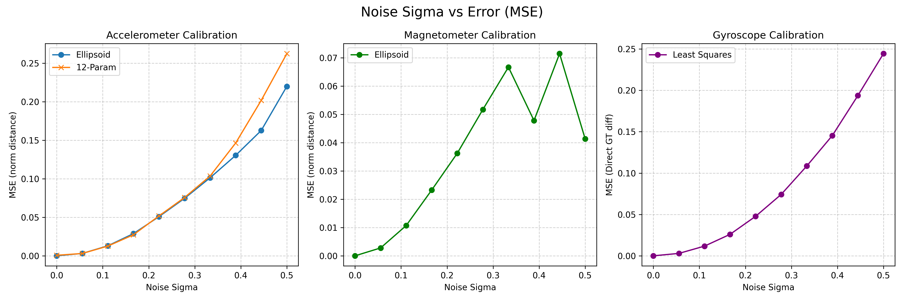
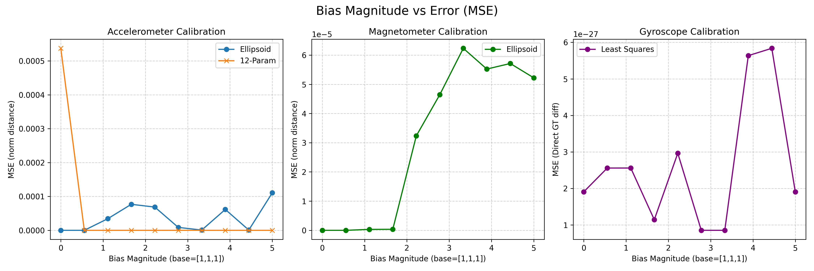

# 센서 보정 실험 및 결과 (Sensor Calibration Results)

## 1. 목적 (Objective)
기존 IMU 센서 모델링 시뮬레이션에서는 노이즈(Noise)와 편향(Bias)이 단일 상수로 하드코딩되어 있어, 캘리브레이션(보정) 알고리즘이 특정 오차 환경에 얼마나 민감한지 추적하기 어려웠습니다. 이번 연구의 목적은 **가우시안 노이즈(Gaussian Noise)의 표준편차($\sigma$)**와 **초기 편향(Bias Vector)의 크기**를 각각 분리하여 독립적으로 제어 가능하도록 파이프라인을 리팩토링하고, 이들의 변화가 각 알고리즘의 오차(Mean Square Error)에 어떤 영향을 미치는지 교차 검증하는 것입니다.

## 2. 구현 방법 (Implementation details)
### 2.1. 시뮬레이터 파라미터화 (Parameterization)
`sensor_simulation.py` 내의 모든 정적/동적 데이터 생성 함수들이 `sigma` 변수와 `b_vector` 변수를 외부에서 전달받을 수 있도록 수정했습니다. (`experiment_sensitivity.py` 스크립트를 통해 스윙파라미터를 입력함)

*사용한 함수 목록:*
- `sim_gyro_static_for_bias()`, `sim_gyro_rate_table_for_M()`
- `sim_acc_6_position_static()`, `sim_acc_multi_position_static()`
- `sim_mag_figure8_dynamic()`

### 2.2. 독립 변수 분리 스윕 (Parameter Sweeps)
서로 다른 물리적 오차가 섞이는 것을 방지하기 위해, 하나의 변수를 조작할 때 다른 하나를 0으로 고정했습니다. (해당 픽스 로직은 `run_sigma_sweep`과 `run_bias_sweep`에 구현되어 있습니다)
- **Sigma Sweep**: Bias를 완전히 0으로 고정하고 ($\mu=0, B=[0,0,0]$), 가우시안 노이즈의 넓이($\sigma$)를 0.0부터 0.5까지 점진적으로 증가시켰습니다.
- **Bias Sweep**: Noise $\sigma$를 0으로 고정하고, 베이스 바이어스 벡터($[1,1,1]$)의 배율을 0배에서 5배까지 점진적으로 증폭시켜 스케일링 오차를 유도했습니다.

## 3. 실험 결과 및 해석 (Results & Analysis)
수천 번의 랜덤 시도(Trials)를 평균화하여, 각 센서별로 노이즈와 바이어스 오차를 어떻게 해결했는지, 파라미터가 증가함에 따라 어떤 결과가 나타났는지 분석했습니다. 아래 시각화 자료는 본 실험에서 도출된 통합 추이입니다.

**데이터 사진 첨부 위치:**

### 3.1. 가속도계 (Accelerometer)
- **적용한 시뮬레이션 해결법**:
  1. **구면 복원 방식 (Ellipsoid Fitting)**: 찌그러진 무작위 3D 데이터 점들을 비선형 최소제곱법으로 계산하여 이상적인 구(Sphere) 형태로 둥글게 펴주는 보편적 방식.
  2. **방정식 기반 방식 (12-Param Iterative)**: 센서를 앞뒤 상하 6개 직교 면에 고정시키고, 역행렬(선형 대수학)을 통해 오차 행렬을 1차 방정식 폼으로 직접 풀어버리는 방식.
- **도출된 결과**: 노이즈(Sigma)가 커질수록 구면 복원 방식의 오차(MSE, 단위: $g^2$) 곡선이 명확하게 더 가파르게 치솟았습니다. 반대로 바이어스(Bias) 증가 실험에서는 두 방법 모두 행렬 역산을 통해 안정적으로 일정하게 상쇄해내었습니다.
- **결과 원인(해석)**: 
    - 6면 고정형 방식(12-Param)은 센서를 한 면에 명확히 고정하고 비교적 긴 시간(n_samples=100) 동안 대량의 데이터를 수집하여 단순 평균을 냄으로써 가우시안 노이즈(분산)를 사전에 대부분 상쇄합니다.
    - 반면 구면 복원 방식(Ellipsoid Fitting)은 3D 구의 겉면을 매핑하기 위해 수십 개의 무작위 각도를 빠르게 돌려가며 데이터를 모아야 하므로 한 자세에서 길게 정지하여 평균을 쌓기에 구조적으로 불리합니다(n_samples=10으로 짧게 정지).
    - 애초에 '적은 각도에서 오래 정지시켜 물리적 노이즈를 평균화하는 6면 방식'과 '다양한 각도로 짧게 멈춰 노이즈 상쇄에 불리한 타원체 수집 기법'이라는 태생적인 샘플링 조건의 차이가 최적화 수렴 민감도의 결정적 원인입니다.

### 3.2. 지자기 센서 (Magnetometer)
- **적용한 시뮬레이션 해결법**: 주변 자성체나 철재 구조물이 만드는 하드/소프트 아이언(Hard/Soft Iron) 왜곡을 보정하기 위해, 가속도계와 동일한 **구면 복원 방식 (Ellipsoid Fitting)**을 적용했습니다. 단, 정지 상태가 아닌 8자 모양으로 연속해서 허공을 젓는(Dynamic) 궤적 데이터를 사용했습니다.
- **도출된 결과**: 노이즈 분산에 비례하여 오차(MSE, 단위: $normalized^2$)가 선형적으로 증가했을 뿐만 아니라, 초기 바이어스(Bias)가 커질 때도 최적화가 길을 잃고 오차가 크게 폭발하는 양상을 보였습니다.
- **결과 원인(해석)**: 
    - **노이즈 취약 원인 (정적 평균화 부재)**: 지자기 센서는 8자를 그리며 허공을 젓는 '동적(Dynamic) 궤적'을 쓰므로 가속도계처럼 멈춰서 노이즈를 평균화(상쇄)하는 것이 원천적으로 불가능해 날것의 노이즈 타격을 받습니다.
    - **바이어스 취약 원인 (공간 스캔 데이터의 불균일성)**: 다중 자세로 그나마 고른 타원면을 채우는 가속도계에 비해, 손목으로 허공에 8자를 긋는 궤적은 3D 타원체 겉면에 정보가 텅 빈 '구멍'들을 많이 만들어냅니다. 정보가 허술한 빈 공간이 많기 때문에 바이어스(중심점 이동)가 커졌을 때 컴퓨터(비선형 최적화)가 진짜 중심을 제대로 유추해 내지 못하고 로컬 미니마(오류 늪)에 쉽게 빠져버리는 한계를 보여줍니다.

### 3.3. 자이로스코프 (Gyroscope)
- **적용한 시뮬레이션 해결법**:
  1. 완벽한 정지 상태에서의 데이터 평균값을 빼내어 제로 레이트 바이어스(Zero-rate Bias)를 1차적으로 걷어냄.
  2. Rate Table(모터로 정밀 제어되는 회전대)의 알고 있는 각속도(Ground Truth)를 기준 데이터로 삼아, **선형 최적화(Linear Least Squares)** 모듈로 교차 축 오차 행렬을 단번에 구하는 정통 캘리브레이션 모형 적용.
- **도출된 결과**: 노이즈 증가에 대해 가속도나 지자기에 비해 오차(MSE, 단위: $(deg/s)^2$)가 아주 급격히 높아지는 노이즈의 취약성이 나타났습니다. 반면, 바이어스(Bias) 크기 증가 스윕에서는 오차가 늘지 않고 완전히 0의 바닥에 붙어서 철벽 방어를 하는 듯한 모습을 보였습니다.
- **결과 원인(해석)**: 자이로스코프의 본질이 각'속도(고주파 신호)'이기 때문에 순간적인 노이즈 변화율 증폭에 태생적으로 매우 취약합니다. 하지만 바이어스(센서가 가만히 있을 때 기본적으로 배출하는 상수 오차)의 경우, 알고리즘 아주 첫 단계에서 단순 평균을 구한 뒤 무조건 모두 빼버리고 시작하기(Zero-rate Bias 도출) 때문에, 초기 측정 바이어스가 아무리 수치가 높아져도 이 기초 뺄셈에 막혀 뒤쪽 알고리즘의 오차 연산에 손끝 하나 미치지 못하게 된 것입니다.

## 4. 추후 방향 (Next Steps)
현재 완성된 시뮬레이터와 보정 파이프라인 결과를 바탕으로, 실제 장착 환경(In-situ)의 물리적 제약이 고려된 **실전용 캘리브레이션 고도화 방안**을 정리하여 교수님과 상담을 진행할 예정입니다. 

### 4.1. 정밀 보정을 위한 보정기법 고도화 및 절충안 제안
본 실험을 통해 동적 궤적과 비선형 피팅 결합의 맹점이 명확히 드러났으며, 최종 장착되는 기체의 물리적 한계에 따라 아래와 같은 현실적인 캘리브레이션 대체 방안 중 하나를 상담 후 채택하고자 합니다.

1. **지자기 센서(Magnetometer)의 장착 환경별 타협안**
   - **초정밀 산업계 (항공우주/방산)**: 거대한 다축 정밀 인덱싱 테이블(기계팔)과 자폐 통제 룸을 이용해, 로봇을 여러 각도로 완벽히 정지시켜 노이즈를 평균화한 뒤 타원체 피팅을 돌리는 궁극의 정적+평균 방식을 씁니다.
   - **Lab-Scale 절충안 (드론/소형 로봇)**: 실험실에서는 비자성체 다면체 지그 안에 기체를 넣고 **'다중 정지 수집(최소 6면 이상) + 타원체 피팅'**을 융합하여 동적 8자 그리기의 노이즈 분산 한계를 극복합니다. 비정형 로봇이라면 사람이 직접 들고 허공에서 '얼음(Stop-and-Go)'을 반복하는 수동 정적 보정을 채택할 수 있습니다.
   - **2D 평면 구속 이동체 (자동차/선박)**: 사람이 들고 3D로 뒤집을 수 없는 무거운 이동체는 넓은 공터에서 뱅글뱅글 도는 자동차의 자율주행 셀프 보정 등을 활용합니다. 단 이 경우 **Z축 보정을 과감히 포기하고 2D 평면 타원 보정(Ellipse Fitting)**만 실시합니다.
   - **초대형 3D 이동체 (로켓/우주선)**: 로켓처럼 기계가 스스로 3D 셀프 동작(텀블링)을 할 수도 없고 사람이 들 수도 없는 최악의 조건에서는, 지자기 센서 채택 자체를 100% 포기하는 배제안을 씁니다. (예외적으로 모터 진동 상쇄가 가능한 무중력 우주 환경의 인공위성은 자체 휠을 통해 느린 셀프 텀블링 3D 보정을 수행합니다.)

2. **자이로스코프(Gyroscope) 연산량 최적화 방안**
   - 기존에는 노이즈 제거를 위해 최소제곱법(Least Squares) 내부 통계 연산에 의존하여 수많은 raw 포인트 집단을 낭비적으로 밀어 넣었습니다. 
   - **개선안**: 가속도계처럼 '같은 각속도로 회전 중인 동적 데이터는 사전 평균(Average)을 내어 단 1개의 노이즈 프리(Noise-free) 점으로 압축'한 뒤 행렬 계산을 돌리는 방식을 제안합니다. 노이즈 상쇄 효과는 유지하되 행렬 연산량을 획기적으로 낮출 수 있습니다.

### 4.2. 쿼터니언 기반 3D 자세 추정 (Orientation Tracking)
교수님과의 상단 논의를 통해 캘리브레이션 스펙이 확정되면, 이렇게 도출된 이상적인 IMU 데이터를 기초로 본격적인 3D 자세 추정 모듈 개발에 진입합니다.

**[데이터 표현 폼(State Representation) 선정 사유]**
자세 연산의 코어 엔진으로 오일러 각도나 방향 코사인 행렬(DCM, Rotation Matrix) 대신 **쿼터니언(Quaternion)**을 최종 채택했습니다.
1. **오일러 각도 대비 비교 우위**: 특정 90도 자세에서 두 축이 겹쳐 회전 자유도를 상실하는 짐벌 락(Gimbal Lock) 한계를 수학적으로 완벽히 차단합니다.
2. **회전 행렬(DCM) 대비 비교 우위 (누적 오차 복원력)**: 
   - 로봇 팔(Manipulator)의 메인 제어기는 관절 간의 위치와 회전을 동시에 연쇄적으로 계산하기 위해 행렬(DCM) 폼을 선호합니다.
   - 하지만 초당 수백 번씩 각속도를 누적(적분)해야 하는 IMU 센서 내부의 트래킹 환경에서는, 행렬을 쓸 경우 누적된 수치 오차로 인해 발생한 찌그러짐(직교성 붕괴)을 복원(그램-슈미트 직교화 등)하는 데 막대한 연산 오버헤드가 발생합니다.
   - 반면 4차원 벡터인 쿼터니언은 단순히 자신의 크기(Norm)로 나누는 아주 가벼운 '나눗셈 정규화(Normalization)'만으로 오차 붕괴를 즉각 복구할 수 있어 초고속 임베디드 코어 환경에 압도적으로 물리적 우위를 가집니다.

**[예정 융합 프로세스]**
- 자이로스코프의 단기적인 동적 응답(고주파 신호)과 가속도계/지자기 센서의 장기적인 안정성(저주파 절대 좌표)을 상보 필터(Complementary Filter) 구조로 융합할 계획입니다.
- 해당 필터가 깎아낸 최종 쿼터니언 데이터는, 모바일 로봇(ROS 등)의 SLAM에는 쿼터니언 상태 그대로 전송하고, 로봇 팔 제어기로 보낼 때는 출력 직전에만 1회성으로 회전 행렬(DCM)로 변환해 던져주는 유연한 출력 파이프라인을 구상하고 있습니다.
